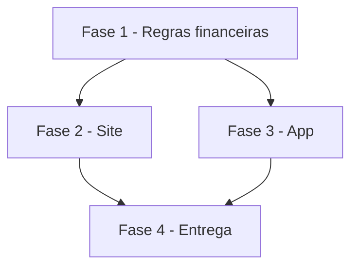

# Tarefas AlfaHome - Fonte única dos números e app simples de usar

Escopo: regras financeiras centralizadas e telas Início, Extrato, Contas e Mais no site e no app, conforme `spec.md` e `plan.md` desta pasta.

**Legenda de status:**
- `[ ]` Pendente
- `[~]` Em andamento
- `[x]` Concluido
- `[!]` Bloqueado

**Legenda de criticidade:**
- `[C]` Critico - Impacto financeiro direto ou bloqueante
- `[A]` Alto - Funcionalidade essencial
- `[M]` Medio - Necessario mas sem urgencia imediata

---

## FASE 1 - Regras financeiras

### 1.1 Saldo com ajuste `[C]`

Ref: FR-002, FR-003, FR-004, FR-006, FR-012

- [ ] 1.1.1 Migration `saldo_ajustes` reversível com ajuste inicial = saldo atual de hoje
- [ ] 1.1.2 `FinanceiroService::saldos()` em centavos, casando conta por nome/banco_id, transferências próprias
- [ ] 1.1.3 Ajustar saldo (serviço, web e API) e recálculo após importação
- [ ] 1.1.4 Testes: entrada/saída realizada, pendente, antes do ajuste, transferência, exclusão, negativo, sem conta, isolamento

### 1.2 Mes e inicio `[C]`

Ref: FR-001, FR-005, FR-007, FR-008

- [ ] 1.2.1 `mes()`, `ultimas()`, `proximos()` e endpoints `/financeiro/inicio`, `/financeiro/resumo`, `/financeiro/contas/{banco}`
- [ ] 1.2.2 `hoje()`, snapshot do app e avisos usam os mesmos saldos
- [ ] 1.2.3 Testes: mesmos números em Início/Resumo/Previsto x Realizado, compra no cartão, mês vazio, virada de mês

---

## FASE 2 - Site

### 2.1 Telas web `[A]`

Ref: FR-009

- [ ] 2.1.1 Helper único de moeda; Início no formato da spec; menu Início/Extrato/Contas
- [ ] 2.1.2 Contas com saldo calculado, cores corretas e Ajustar saldo
- [ ] 2.1.3 Testes de tela

---

## FASE 3 - App

### 3.1 Navegacao e telas `[A]`

Ref: FR-009, FR-010, FR-011

- [ ] 3.1.1 Abas Início | Extrato | Contas | Mais
- [ ] 3.1.2 Início novo com `/financeiro/inicio`
- [ ] 3.1.3 Extrato com busca por valor; Contas compacta com cores e detalhe com Ajustar saldo
- [ ] 3.1.4 Resumo do mês simples (sem "economizou"); moeda única
- [ ] 3.1.5 Testes de widget

---

## FASE 4 - Entrega

### 4.1 Publicacao `[M]`

- [ ] 4.1.1 Suítes verdes, CHANGELOG, API doc, deploy e conferência em produção

---

## Matriz de Dependencias

## Resumo Quantitativo

| Fase | Tarefas | Subtarefas | Criticidade |
|------|---------|------------|-------------|
| 1 - Regras financeiras | 2 | 7 | C |
| 2 - Site | 1 | 3 | A |
| 3 - App | 1 | 5 | A |
| 4 - Entrega | 1 | 1 | M |
| **Total** | **5** | **16** | - |

## Escopo Coberto

| Item | Descricao | Fase |
|------|-----------|------|
| US1 | Mesmos números em toda tela | 1, 2, 3 |
| US2 | Saldo calculado com ajuste | 1, 2, 3 |
| US3 | Início, Extrato, Contas e Mais | 2, 3 |

## Escopo Excluido

| Item | Descricao | Motivo |
|------|-----------|--------|
| Registrar pelo app | Botão "+", formulário rápido | Decisão do Felipe: o app só visualiza |
| Pagamento de fatura no sistema manual | Fluxo de pagar fatura | Planilha não registra pagamento; sistema manual fica secundário |
| Reescrever telas manuais antigas | Despesas/Receitas/Fluxo de caixa web | Saem do caminho principal; ficam acessíveis |
