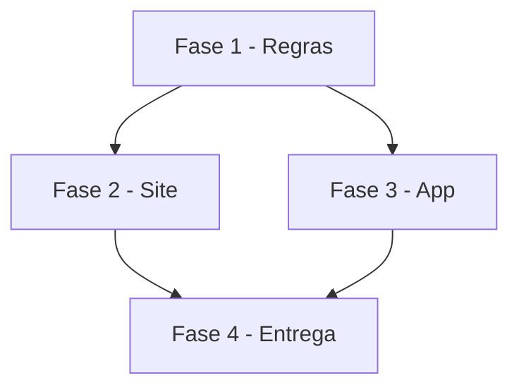

# Tarefas AlfaHome - Lançamento manual (famílias sem planilha)

Escopo: lançar, editar e pagar pelo sistema (site e app), com cartão e fatura, conforme `spec.md` e `plan.md` desta pasta.

**Legenda de status:**
- `[ ]` Pendente
- `[~]` Em andamento
- `[x]` Concluido
- `[!]` Bloqueado

**Legenda de criticidade:**
- `[C]` Critico - Impacto financeiro direto ou bloqueante
- `[A]` Alto - Funcionalidade essencial
- `[M]` Medio - Necessario mas sem urgencia imediata

---

## FASE 1 - Regras (servidor)

### 1.1 Servico de lancamentos `[C]`

Ref: FR-001, FR-003, FR-006, FR-010

- [x] 1.1.1 `LancamentoService` (criar saída/entrada/transferência, editar, marcar pago, excluir com escopo) reaproveitando os modelos e regras atuais
- [x] 1.1.2 Migration `pago_com_banco_id` e "Pagar fatura" (compras pendentes da fatura → pagas na data/conta)
- [x] 1.1.3 API v1 passa a usar o serviço; endpoint pagar fatura
- [x] 1.1.4 Testes: lançar, pagar, excluir, transferência, pagar fatura sem contagem dupla, outra família

### 1.2 Numeros com o sistema `[C]`

Ref: FR-004, FR-005, FR-007

- [x] 1.2.1 Transferências no Extrato e movimentos; saldo debita `pago_com_banco_id` na compra paga
- [x] 1.2.2 Vencimentos com pendências e faturas do sistema; cartões do sistema no Início/Cartões
- [x] 1.2.3 Testes de números (mês, saldo, fatura, vencimentos) com família só manual e mista

---

## FASE 2 - Site

### 2.1 Telas `[A]`

Ref: FR-001, FR-002, FR-003, FR-008, FR-009

- [x] 2.1.1 "+ Lançar" (modal Saída/Entrada/Transferência + Mais opções) no Início e no Extrato
- [x] 2.1.2 Extrato: abrir lançamento do sistema com editar, marcar pago e excluir
- [x] 2.1.3 Cartões: "Pagar fatura" nos cartões do sistema
- [x] 2.1.4 Início novo para toda família; primeiro passo sem contas
- [x] 2.1.5 Testes de tela

---

## FASE 3 - App

### 3.1 Telas `[A]`

Ref: FR-001, FR-002, FR-003, FR-008

- [x] 3.1.1 "+ Lançar" com Saída/Entrada/Transferência e Mais opções (parcelas, recorrência)
- [x] 3.1.2 Extrato: editar, marcar pago e excluir lançamentos do sistema
- [x] 3.1.3 Início novo para toda família; Pagar fatura
- [x] 3.1.4 Testes de widget

---

## FASE 4 - Entrega

### 4.1 Publicacao `[M]`

- [ ] 4.1.1 Suítes verdes, CHANGELOG, API doc, deploy e conta do Alexandre

---

## Matriz de Dependencias

## Resumo Quantitativo

| Fase | Tarefas | Subtarefas | Criticidade |
|------|---------|------------|-------------|
| 1 - Regras | 2 | 7 | C |
| 2 - Site | 1 | 5 | A |
| 3 - App | 1 | 4 | A |
| 4 - Entrega | 1 | 1 | M |
| **Total** | **5** | **17** | - |

## Escopo Coberto

| Item | Descricao | Fase |
|------|-----------|------|
| US1 | Lançar saída, entrada e transferência | 1, 2, 3 |
| US2 | Editar, pagar e excluir pelo Extrato | 1, 2, 3 |
| US3 | Cartão com fatura | 1, 2, 3 |
| US4 | Início e vencimentos sem planilha | 1, 2, 3 |

## Escopo Excluido

| Item | Descricao | Motivo |
|------|-----------|--------|
| Importar extrato OFX/CSV | Lançar em lote pelo extrato do banco | Fora desta rodada |
| Avisos no Telegram para o Alexandre | Liberar a família dele | Decisão à parte (hoje só a família do Felipe) |
| Criar a família do Alexandre | Cadastro de nova família | Feito por quem administra o sistema |
