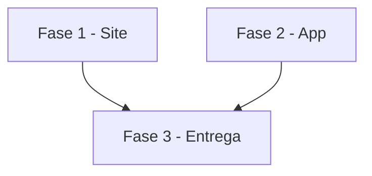

# Tarefas AlfaHome - Lançamentos da planilha numa tela só

Escopo: uma tela de Lançamentos com os dados da planilha no site e no app, conforme `spec.md` e `plan.md` desta pasta.

**Legenda de status:**
- `[ ]` Pendente
- `[~]` Em andamento
- `[x]` Concluido
- `[!]` Bloqueado

**Legenda de criticidade:**
- `[C]` Critico - Impacto financeiro direto ou bloqueante
- `[A]` Alto - Funcionalidade essencial
- `[M]` Medio - Necessario mas sem urgencia imediata

---

## FASE 1 - Site

### 1.1 Tela de lancamentos `[A]`

Ref: FR-001 a FR-004, FR-007, FR-008

- [x] 1.1.1 Rota e controller com filtros (tipo, situação, busca sem acento, categoria, conta)
- [x] 1.1.2 View: totais do mês, filtros, lista agrupada por dia, estado vazio, aviso de somente leitura
- [x] 1.1.3 Testes: totais, cada filtro, busca sem acento, mês vazio, isolamento

### 1.2 Menu `[A]`

Ref: FR-005

- [x] 1.2.1 Seção Lançamentos com Lançamentos (planilha) e Investimentos; Configurações com Planilha e Avisos
- [x] 1.2.2 Teste: menu sem Despesas/Receitas; rotas antigas respondem

---

## FASE 2 - App

### 2.1 Aba Lancamentos `[A]`

Ref: FR-006

- [x] 2.1.1 Página com mês, filtros, totais e lista por dia lendo a API existente
- [x] 2.1.2 Aba Lançamentos aponta para a página nova
- [x] 2.1.3 Teste de widget com fixture

---

## FASE 3 - Entrega

### 3.1 Publicacao `[M]`

- [ ] 3.1.1 Suítes verdes, CHANGELOG, deploy por tag e push do app

---

## Matriz de Dependencias

## Resumo Quantitativo

| Fase | Tarefas | Subtarefas | Criticidade |
|------|---------|------------|-------------|
| 1 - Site | 2 | 5 | A |
| 2 - App | 1 | 3 | A |
| 3 - Entrega | 1 | 1 | M |
| **Total** | **4** | **9** | - |

## Escopo Coberto

| Item | Descricao | Fase |
|------|-----------|------|
| US1 | Ver os lançamentos do mês | 1, 2 |
| US2 | Filtrar | 1, 2 |
| US3 | Menu sem telas vazias | 1, 2 |

## Escopo Excluido

| Item | Descricao | Motivo |
|------|-----------|--------|
| Lançar pela tela | Criar/editar lançamento | Planilha é a fonte (constitution II) |
| Remover rotas antigas | Despesas/Receitas manuais | Saem só do menu; links salvos continuam |
