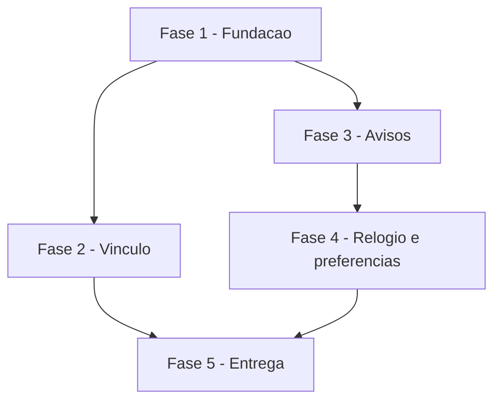

# Tarefas AlfaHome - Notificações pelo Telegram

Escopo: avisos pelo Telegram (resumo às 7h e alertas na hora), conforme `spec.md` e `plan.md` desta pasta.

**Legenda de status:**
- `[ ]` Pendente
- `[~]` Em andamento
- `[x]` Concluido
- `[!]` Bloqueado

**Legenda de criticidade:**
- `[C]` Critico - Impacto financeiro direto ou bloqueante
- `[A]` Alto - Funcionalidade essencial
- `[M]` Medio - Necessario mas sem urgencia imediata

---

## FASE 1 - Fundacao

### 1.1 Estrutura de dados `[A]`

Ref: FR-001, FR-011, FR-015

- [x] 1.1.1 Migration `notificacao_configs`, `telegram_destinatarios`, `notificacao_envios`, `notificacao_estados` com `down()`
- [x] 1.1.2 Models com `BelongsToTenant`; token com cast `encrypted` e oculto
- [x] 1.1.3 Teste: token não aparece em `toArray()` e fica cifrado no banco

### 1.2 Cliente do Telegram `[A]`

Ref: FR-001, FR-012

- [x] 1.2.1 `TelegramClient`: `getMe`, `setWebhook`, `sendMessage` com classificação de erro (temporário x bloqueado)
- [x] 1.2.2 Teste com `Http::fake()`: ok, 429/500 temporário, 403 bloqueado, 400 chat not found

---

## FASE 2 - Vinculo (US1)

### 2.1 Tela e webhook `[A]`

Ref: FR-001 a FR-004

- [x] 2.1.1 Tela Notificações (só dono): salvar token validado, link de vínculo, lista de destinatários, remover
- [x] 2.1.2 Webhook com segredo: `/start <código>` válido vincula e responde; inválido ou vencido recusa
- [x] 2.1.3 Teste: token inválido recusado; vínculo; código vencido; segredo errado 403; outro tenant

---

## FASE 3 - Avisos (US2, US3)

### 3.1 Detecção `[C]`

Ref: FR-005 a FR-010

- [x] 3.1.1 Resumo às 7h com números de `hoje()`, uma vez por dia
- [x] 3.1.2 Contas a pagar d-3 e d0; contas a receber d0 e atraso
- [x] 3.1.3 Saldo negativo e limite acima de 80% com estado (sem repetir enquanto durar)
- [x] 3.1.4 Compra nova no cartão depois de `ligado_em`
- [x] 3.1.5 Testes de cada aviso, incluindo não repetir e primeira análise sem avalanche

### 3.2 Fila e envio `[C]`

Ref: FR-011, FR-012

- [x] 3.2.1 Enfileirar com dedupe (`destinatario_id`, `chave`) e tomada atômica
- [x] 3.2.2 Nova tentativa até 5 vezes em 24 h; bloqueio desativa destinatário
- [x] 3.2.3 Testes: duplicata, retry, expiração, bloqueio

---

## FASE 4 - Relogio e preferencias (US4)

### 4.1 Relogio `[A]`

Ref: FR-014, FR-013

- [x] 4.1.1 Endpoint com chave HMAC e comando `notificacoes:processar` agendado a cada 15 min
- [x] 4.1.2 Relógio analisa a planilha se a última verificação passou de 1 h
- [x] 4.1.3 Workflow `relogio.yml` (cron 15 min) usando o segredo `ALFAHOME_RELOGIO_URL`
- [x] 4.1.4 Ligar/desligar tipos e enviar teste
- [x] 4.1.5 Teste: chave errada 403; chave certa processa; tipo desligado não envia

---

## FASE 5 - Entrega

### 5.1 Publicacao `[M]`

- [x] 5.1.1 Suíte completa verde, CHANGELOG e menu
- [ ] 5.1.2 Deploy, salvar token em produção, vincular Felipe e enviar teste

---

## Matriz de Dependencias

## Resumo Quantitativo

| Fase | Tarefas | Subtarefas | Criticidade |
|------|---------|------------|-------------|
| 1 - Fundacao | 2 | 5 | A |
| 2 - Vinculo | 1 | 3 | A |
| 3 - Avisos | 2 | 8 | C |
| 4 - Relogio e preferencias | 1 | 5 | A |
| 5 - Entrega | 1 | 2 | M |
| **Total** | **7** | **23** | - |

## Escopo Coberto

| Item | Descricao | Fase |
|------|-----------|------|
| US1 | Vincular o Telegram | 2 |
| US2 | Resumo do dia às 7h | 3 |
| US3 | Alertas na hora | 3 |
| US4 | Ligar, desligar e testar | 4 |

## Escopo Excluido

| Item | Descricao | Motivo |
|------|-----------|--------|
| E-mail | Avisos por e-mail | Decisão do Felipe em 04/10/2026: só Telegram por enquanto |
| Lançar despesa pelo bot | Texto, áudio e perguntas | Frente própria, com spec separada |
| Tela no app Flutter | Configurar avisos no app | Configuração é feita uma vez, na web |
