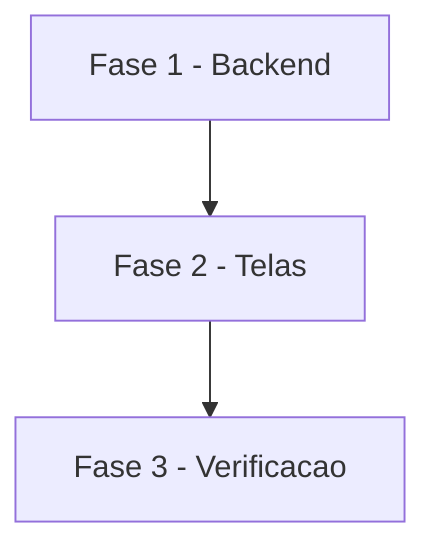

# Tarefas AlfaHome - Painel do dia

Escopo: painel do dia na web e no app, conforme `spec.md` e `plan.md`.

**Legenda de status:**
- `[ ]` Pendente
- `[~]` Em andamento
- `[x]` Concluido
- `[!]` Bloqueado

**Legenda de criticidade:**
- `[C]` Critico - Impacto financeiro direto ou bloqueante
- `[A]` Alto - Funcionalidade essencial
- `[M]` Medio - Necessario mas sem urgencia imediata

---

## FASE 1 - Backend

### 1.1 Painel no servico e na API `[A]`

Ref: FR-001 a FR-007, FR-009

- [x] 1.1.1 `PlanejamentoService::hoje()`
- [x] 1.1.2 `GET /api/v1/planejamento/hoje`
- [x] 1.1.3 Testes: saldos, janela de 7 dias, atrasado, projeção, isolamento

## FASE 2 - Telas

### 2.1 Web `[A]`

Ref: FR-008

- [x] 2.1.1 Bloco "Hoje" no topo do dashboard
- [x] 2.1.2 Esconder do topo os blocos que leem só lançamentos manuais quando a planilha existe
- [x] 2.1.3 Teste de tela

### 2.2 App `[A]`

Ref: FR-007, FR-008

- [x] 2.2.1 Entidade, DTO, repositório e provider do painel
- [x] 2.2.2 Card "Hoje" no topo da tela inicial
- [x] 2.2.3 Testes de DTO e de widget

## FASE 3 - Verificacao

### 3.1 Qualidade `[A]`

- [x] 3.1.1 Suítes PHPUnit e Flutter verdes
- [x] 3.1.2 Conferência com os dados de produção

---

## Matriz de Dependencias

## Resumo Quantitativo

| Fase | Tarefas | Subtarefas | Criticidade |
|------|---------|------------|-------------|
| 1 - Backend | 1 | 3 | A |
| 2 - Telas | 2 | 6 | A |
| 3 - Verificacao | 1 | 2 | A |
| **Total** | **4** | **11** | - |

## Escopo Coberto

| Item | Descricao | Fase |
|------|-----------|------|
| US1 | Saldo e vencimentos | 1, 2 |
| US2 | Mês e cartões | 1, 2 |
| US3 | App | 2 |

## Escopo Excluido

| Item | Descricao | Motivo |
|------|-----------|--------|
| Notificação push de manhã | Aviso diário no celular | Frente própria |
