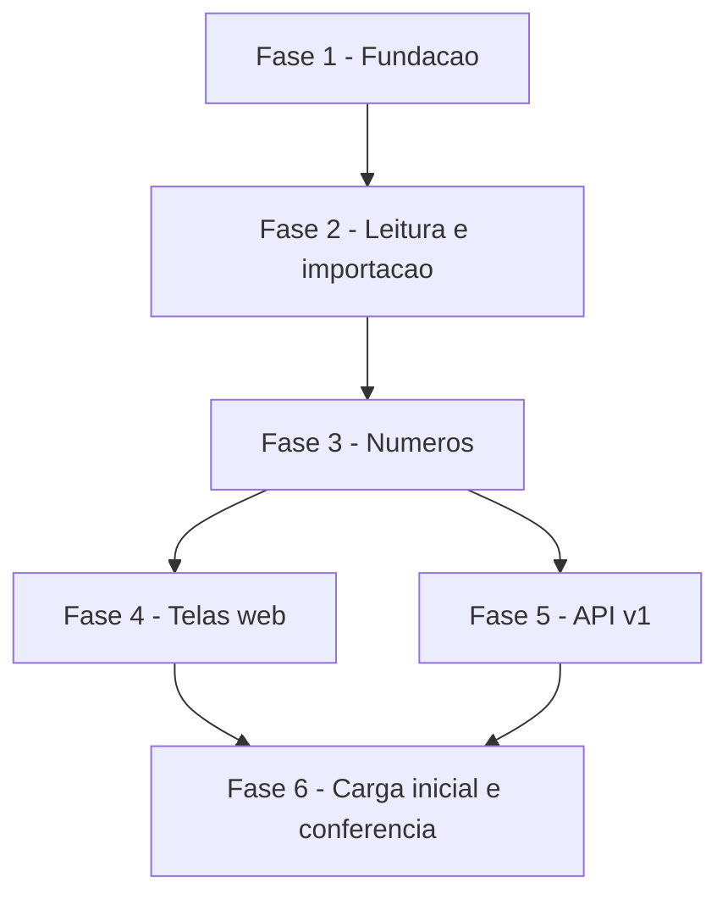

# Tarefas AlfaHome - Planejamento financeiro a partir da planilha

Escopo: importar a planilha de planejamento para o AlfaHome (web + API v1) e exibir os mesmos números, conforme `spec.md` e `plan.md` desta pasta.

**Legenda de status:**
- `[ ]` Pendente
- `[~]` Em andamento
- `[x]` Concluido
- `[!]` Bloqueado

**Legenda de criticidade:**
- `[C]` Critico - Impacto financeiro direto ou bloqueante
- `[A]` Alto - Funcionalidade essencial
- `[M]` Medio - Necessario mas sem urgencia imediata

---

## FASE 1 - Fundacao

### 1.1 Estrutura de dados `[A]`

Ref: data-model.md; FR-009, FR-022, FR-026

- [x] 1.1.1 Migration `planilha_importacoes` com `down()`
- [x] 1.1.2 Migration das seis tabelas `plan_*` (tenant_id, chave única por tenant, conteudo_hash) com `down()`
- [x] 1.1.3 Models `PlanilhaImportacao`, `PlanLancamento`, `PlanContaFixa`, `PlanCartao`, `PlanCompraParcelada`, `PlanDivida`, `PlanMeta` com `BelongsToTenant`, casts e atributos calculados
- [x] 1.1.4 Teste: `migrate:fresh` e `migrate:rollback` passam; atributos calculados (limite disponível, valor da parcela, restantes, saldo, falta, % concluído, amortizado)

### 1.2 Planilha de referencia como fixture `[A]`

Ref: constitution III; quickstart.md

- [x] 1.2.1 Copiar a planilha de 03/10/2026 para `tests/Fixtures/planilha/planejamento_v2.xlsx`
- [x] 1.2.2 Helper de teste que gera variações do arquivo (linha alterada, incluída, removida, aba ausente, valor inválido)
- [x] 1.2.3 Teste do helper: o arquivo gerado abre e contém a alteração pedida

---

## FASE 2 - Leitura e importacao (US1)

### 2.1 Leitor de xlsx `[A]`

Ref: research.md Decision 2

- [x] 2.1.1 `XlsxReader`: abas, textos compartilhados, valores em cache, datas seriais
- [x] 2.1.2 Recusar arquivo que não é xlsx válido com mensagem em português
- [x] 2.1.3 Teste unitário: lê as 10 abas da fixture; célula de texto, número, data e vazia

### 2.2 Parser das abas `[C]`

Ref: research.md Decisions 3 e 4; FR-002, FR-003, FR-010, FR-011, FR-012, FR-022

- [x] 2.2.1 Validação de estrutura: abas e cabeçalhos esperados, com lista do que falta
- [x] 2.2.2 Parser de Lançamentos (ignora linhas vazias, apara textos, normaliza tipo/forma/status)
- [x] 2.2.3 Parsers de Contas Fixas, Cartões, Compras Parceladas, Dívidas e Metas
- [x] 2.2.4 Erros por linha com aba, linha e motivo; campos vazios permanecem nulos
- [x] 2.2.5 Cálculo de `chave` (identidade + ordinal) e `conteudo_hash`
- [x] 2.2.6 Teste unitário: contagens da fixture (52, 9, 3, 6, 2, 2), linhas idênticas com chaves distintas, status "Pago" em receita, cartão sem valores

### 2.3 Servico de importacao `[C]`

Ref: FR-001, FR-003 a FR-008, FR-027, FR-031

- [x] 2.3.1 `PlanilhaImportService`: diff incluir/atualizar/remover/manter em transação única
- [x] 2.3.2 Criação de categoria inexistente e avisos (categoria nova, cartão não cadastrado)
- [x] 2.3.3 Registro em `planilha_importacoes` (sucesso, sem alterações, rejeitada)
- [x] 2.3.4 Teste: carga inicial com as contagens da spec
- [x] 2.3.5 Teste: reimportação idêntica não altera nenhum registro (idempotência)
- [x] 2.3.6 Teste: arquivo alterado → uma atualizada, uma incluída, uma removida
- [x] 2.3.7 Teste: linha inválida e aba ausente → rejeitada, dados anteriores intactos
- [x] 2.3.8 Teste: lançamentos manuais e saldos de `bancos` intactos após importar

### 2.4 Comando de carga `[A]`

Ref: FR-029; research.md Decision 7

- [x] 2.4.1 Comando `planilha:importar {arquivo} {--tenant=}` com relatório no terminal
- [x] 2.4.2 Mensagens de erro (arquivo inexistente, tenant inexistente)
- [x] 2.4.3 Teste do comando com a fixture

---

## FASE 3 - Numeros (US2)

### 3.1 Servico de planejamento `[C]`

Ref: research.md Decision 5; FR-013 a FR-015, FR-017 a FR-021, FR-023, FR-024, FR-032, FR-033

- [x] 3.1.1 Resumo do mês: previsto x realizado, saldo, economia %, comprometimento %
- [x] 3.1.2 Despesas por categoria e lista de lançamentos do mês com diferença e origem
- [x] 3.1.3 Visão anual: 12 meses + total
- [x] 3.1.4 Resumos de cartões, parceladas, dívidas, metas e contas fixas
- [x] 3.1.5 Soma de despesas/receitas manuais do mês, identificadas pela origem
- [x] 3.1.6 Teste de conferência: todos os números de agosto/2026 citados na spec
- [x] 3.1.7 Teste: mês vazio e divisores zero resultam em 0, sem erro

### 3.2 Previsto preservado nos lancamentos manuais `[C]`

Ref: research.md Decision 6; FR-009

- [x] 3.2.1 Migration `valor_previsto` em `despesas` e `receitas` com `down()`
- [x] 3.2.2 Baixa no fluxo de caixa grava o previsto original quando o valor muda; estorno restaura
- [x] 3.2.3 Teste: baixar com valor diferente mantém previsto e realizado distintos

---

## FASE 4 - Telas web (US1 a US6)

### 4.1 Importar planilha `[A]`

Ref: FR-001, FR-007, FR-008, FR-027, FR-028

- [x] 4.1.1 Tela de envio com relatório por aba, avisos e erros
- [x] 4.1.2 Histórico das importações
- [x] 4.1.3 Somente o dono da conta acessa
- [x] 4.1.4 Teste: envio da fixture, envio inválido, usuário sem permissão

### 4.2 Resumo do mes e visao anual `[A]`

Ref: FR-013 a FR-016, FR-030

- [x] 4.2.1 Tela do mês: cartões de números, despesas por categoria, lançamentos com previsto/realizado/diferença e origem, seletor de mês
- [x] 4.2.2 Tela anual: tabela mês a mês e total
- [x] 4.2.3 Registros da planilha sem ações de edição; aviso "mantido na planilha"
- [x] 4.2.4 Teste: telas respondem 200 com os valores de agosto/2026 e com mês vazio

### 4.3 Cartoes, parceladas, dividas, metas e contas fixas `[A]`

Ref: FR-017 a FR-021

- [x] 4.3.1 Tela de cartões e compras parceladas
- [x] 4.3.2 Tela de dívidas
- [x] 4.3.3 Tela de metas
- [x] 4.3.4 Tela de contas fixas
- [x] 4.3.5 Teste: cada tela responde 200 com os valores da fixture e com lista vazia

### 4.4 Menu e painel inicial `[M]`

Ref: FR-024

- [x] 4.4.1 Grupo "Planejamento" no menu lateral e no menu mobile
- [x] 4.4.2 Bloco da planilha no painel inicial
- [x] 4.4.3 Teste: painel responde 200 com e sem importação

---

## FASE 5 - API v1 (US7)

### 5.1 Endpoints de leitura `[A]`

Ref: contracts/api-v1-planejamento.md; FR-025, FR-026

- [x] 5.1.1 `PlanejamentoApiController`: resumo, anual, lançamentos
- [x] 5.1.2 Cartões, parceladas, dívidas, metas, contas fixas, importações
- [x] 5.1.3 Rotas em `routes/api.php` sob `auth:sanctum` + `tenant.ativo.api`
- [x] 5.1.4 Teste de contrato: chaves e valores de cada endpoint com a fixture
- [x] 5.1.5 Teste: sem token → 401; outro tenant → vazio

### 5.2 Importacao pela API `[M]`

Ref: FR-001, FR-027

- [x] 5.2.1 `POST planejamento/importar` (multipart) com respostas 200/422/403
- [x] 5.2.2 Teste: sucesso, rejeição e papel sem permissão
- [x] 5.2.3 Atualizar `docs/API_V1_MOBILE.md` com os endpoints novos

---

## FASE 6 - Carga inicial e conferencia

### 6.1 Carga local `[A]`

Ref: FR-029; quickstart.md

- [x] 6.1.1 Banco local zerado, família do Felipe criada, planilha importada pelo comando
- [x] 6.1.2 Conferência manual das telas contra a planilha (cenários 1 a 7 do quickstart) <!-- conferido por screenshot em 03/10/2026 com a planilha das 20:32 -->
- [x] 6.1.3 Suíte PHPUnit completa verde

---

## Matriz de Dependencias

## Resumo Quantitativo

| Fase | Tarefas | Subtarefas | Criticidade |
|------|---------|------------|-------------|
| 1 - Fundacao | 2 | 7 | A |
| 2 - Leitura e importacao | 4 | 20 | C |
| 3 - Numeros | 2 | 10 | C |
| 4 - Telas web | 4 | 16 | A |
| 5 - API v1 | 2 | 8 | A |
| 6 - Carga inicial e conferencia | 1 | 3 | A |
| **Total** | **15** | **64** | - |

## Escopo Coberto

| Item | Descricao | Fase |
|------|-----------|------|
| US1 | Importar a planilha (atômica, idempotente, com relatório) | 2, 4 |
| US2 | Mês e ano: previsto x realizado | 3, 4 |
| US3 | Cartões e compras parceladas | 3, 4 |
| US4 | Dívidas | 3, 4 |
| US5 | Metas | 3, 4 |
| US6 | Contas fixas | 3, 4 |
| US7 | API v1 para o app | 5 |

## Escopo Excluido

| Item | Descricao | Motivo |
|------|-----------|--------|
| App Flutter | Telas no AlfaHomeApp | Spec própria no repositório do app, consumindo a API desta feature |
| Leitura automática de pasta | Buscar a planilha no OneDrive sem envio manual | Fora desta feature (clarificação de 03/10/2026) |
| Correção geral do sistema | Defeitos existentes fora do planejamento | Tratada à parte via `/cstk:bugfix` |
| Deploy em produção | Publicação por tag | Depende de autorização e de acesso ao servidor |
