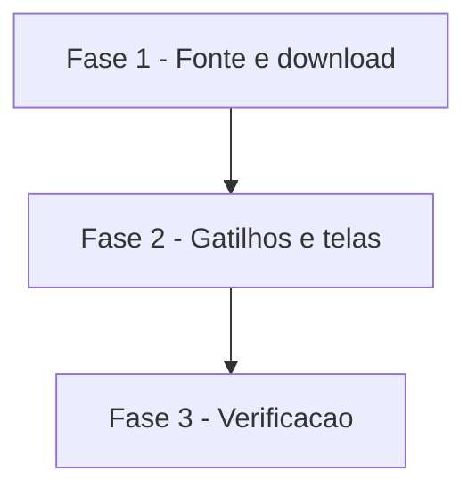

# Tarefas AlfaHome - Análise automática da planilha

Escopo: link do OneDrive, botão Analisar e verificação diária, conforme `spec.md` e `plan.md` desta pasta.

**Legenda de status:**
- `[ ]` Pendente
- `[~]` Em andamento
- `[x]` Concluido
- `[!]` Bloqueado

**Legenda de criticidade:**
- `[C]` Critico - Impacto financeiro direto ou bloqueante
- `[A]` Alto - Funcionalidade essencial
- `[M]` Medio - Necessario mas sem urgencia imediata

---

## FASE 1 - Fonte e download

### 1.1 Fonte da planilha `[A]`

Ref: FR-001 a FR-005, FR-014, FR-015

- [x] 1.1.1 Migration `planilha_fontes` com `down()` e model com link cifrado
- [x] 1.1.2 `PlanilhaFonteService`: validar host, baixar pela API do OneDrive, conferir tamanho e formato
- [x] 1.1.3 Teste: link de outro site recusado sem nenhuma chamada HTTP; HTML e arquivo grande recusados

### 1.2 Analisar `[C]`

Ref: FR-006 a FR-008, FR-011

- [x] 1.2.1 `analisar()`: baixa, importa pelo serviço existente e grava o resultado na fonte
- [x] 1.2.2 Modo automático: arquivo igual ao último importado só atualiza a data
- [x] 1.2.3 Teste: alteração detectada, sem alteração, planilha inválida e falha de download mantendo os dados

---

## FASE 2 - Gatilhos e telas

### 2.1 Tela e botão `[A]`

Ref: FR-001, FR-003, FR-004, FR-006, FR-012, FR-015

- [x] 2.1.1 Salvar e remover o link na tela de importação, com teste imediato do link
- [x] 2.1.2 Botão Analisar e situação da última verificação nas telas de planejamento
- [x] 2.1.3 Teste: salvar válido/ inválido, remover, permissão, link não exibido

### 2.2 Verificação diária `[A]`

Ref: FR-009, FR-010, FR-013

- [x] 2.2.1 Middleware de primeiro acesso do dia (web e API), com trava e execução após a resposta
- [x] 2.2.2 Comando `planilha:analisar` e registro no agendador
- [x] 2.2.3 Teste: uma verificação por dia, falha de uma família isolada das demais

### 2.3 API `[M]`

Ref: FR-016

- [x] 2.3.1 `POST planejamento/analisar` e `GET planejamento/fonte`
- [x] 2.3.2 Documentar em `docs/API_V1_MOBILE.md`
- [x] 2.3.3 Teste de contrato e de isolamento por família

---

## FASE 3 - Verificacao

### 3.1 Qualidade `[A]`

- [x] 3.1.1 Suíte PHPUnit completa verde
- [x] 3.1.2 Conferência no navegador do fluxo de salvar link e analisar (local)
- [x] 3.1.3 Validação com o link real do OneDrive do Felipe <!-- 04/10/2026: a API antiga respondeu 401; trocada pelo acesso de visitante, que baixou a planilha -->

---

## Matriz de Dependencias

## Resumo Quantitativo

| Fase | Tarefas | Subtarefas | Criticidade |
|------|---------|------------|-------------|
| 1 - Fonte e download | 2 | 6 | C |
| 2 - Gatilhos e telas | 3 | 9 | A |
| 3 - Verificacao | 1 | 3 | A |
| **Total** | **6** | **18** | - |

## Escopo Coberto

| Item | Descricao | Fase |
|------|-----------|------|
| US1 | Configurar o link | 1, 2 |
| US2 | Botão Analisar | 1, 2 |
| US3 | Verificação diária | 2 |

## Escopo Excluido

| Item | Descricao | Motivo |
|------|-----------|--------|
| Telegram | Bot e conciliação dos lançamentos | Feature própria (`telegram-bot`) |
| Login Microsoft | Ler OneDrive com autenticação | Só se o link anônimo não funcionar |
